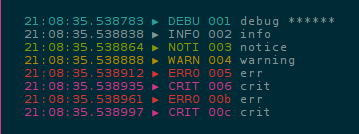

## Golang logging library

[](https://travis-ci.org/op/go-logging)

Package logging implements a logging infrastructure for Go. Its output format
is customizable and supports different logging backends like syslog, file and
memory. Multiple backends can be utilized with different log levels per backend
and logger.

## Example

Let's have a look at an [example](examples/example.go) which demonstrates most
of the features found in this library.

[](examples/example.go)

```go
package main

import (
	"os"

	"github.com/op/go-logging"
)

var log = logging.MustGetLogger("example")

// Example format string. Everything except the message has a custom color
// which is dependent on the log level. Many fields have a custom output
// formatting too, eg. the time returns the hour down to the milli second.
var format = "%{color}%{time:15:04:05.000000} ▶ %{level:.4s} %{id:03x}%{color:reset} %{message}"

// Password is just an example type implementing the Redactor interface. Any
// time this is logged, the Redacted() function will be called.
type Password string

func (p Password) Redacted() interface{} {
	return logging.Redact(string(p))
}

func main() {
	// Setup one stderr and one syslog backend and combine them both into one
	// logging backend. By default stderr is used with the standard log flag.
	logBackend := logging.NewLogBackend(os.Stderr, "", 0)
	syslogBackend, err := logging.NewSyslogBackend("")
	if err != nil {
		log.Fatal(err)
	}
	logging.SetBackend(logBackend, syslogBackend)
	logging.SetFormatter(logging.MustStringFormatter(format))

	// For "example", set the log level to DEBUG and ERROR.
	for _, level := range []logging.Level{logging.DEBUG, logging.ERROR} {
		logging.SetLevel(level, "example")

		log.Debug("debug %s", Password("secret"))
		log.Info("info")
		log.Notice("notice")
		log.Warning("warning")
		log.Error("err")
		log.Critical("crit")
	}
}
```

## Installing

### Using *go get*

    $ go get github.com/op/go-logging

After this command *go-logging* is ready to use. Its source will be in:

    $GOROOT/src/pkg/github.com/op/go-logging

You can use `go get -u` to update the package.

## Documentation

For docs, see http://godoc.org/github.com/op/go-logging or run:

    $ godoc github.com/op/go-logging

